<h1 align="center">Hi, I'm Mohit Suthar 👋</h1>

  

<h3 align="center">Full Stack Developer • DSA Problem Solver • Data Analytics Enthusiast</h3>

  

  
  &nbsp;&nbsp;
  

---

### 🚀 About Me

- 🎓 B.Tech Computer Science Engineering student at **Mohan Lal Sukhadia University (MLSU), Udaipur**
- 🧠 Currently sharpening **DSA** (Coder Army) and preparing for FAANG-style interviews
- 📊 Exploring **Data Analytics** with Python — pandas, matplotlib, seaborn, NumPy
- 🌱 Learning full-stack development and experimenting with AI-assisted dev tools

---

### 🛠️ Tech Stack

<table align="center">
  <tr>
    <td align="center"><b>Languages</b></td>
    <td align="center">
      
    </td>
  </tr>
   <tr>
    <td align="center"><b>Mobile &amp; Frameworks</b></td>
    <td align="center">
      
      
    </td>
  </tr>
   <tr>
    <td align="center"><b>Databases</b></td>
    <td align="center">
      
      
    </td>
  <tr>
  <td align="center"><b>Data &amp; Tools</b></td>
  <td align="center">
    &nbsp;
    &nbsp;
    &nbsp;
    &nbsp;
    &nbsp;
    
  </td>
</tr>
  <tr>
    <td align="center"><b>Coding Profiles</b></td>
    <td align="center">
      
      &nbsp;&nbsp;
      
    </td>
  </tr>
</table>

  

  

---

### 📊 GitHub Stats

  <!-- Row 1: stats + top languages -->
  
  

    

  <!-- Row 2: streak -->
  

    

### 🐍 Contribution Snake

  <picture>
    <source media="(prefers-color-scheme: dark)" srcset="https://raw.githubusercontent.com/mohitjangid21797-crypto/mohitjangid21797-crypto/output/github-contribution-grid-snake-dark.svg">
    <source media="(prefers-color-scheme: light)" srcset="https://raw.githubusercontent.com/mohitjangid21797-crypto/mohitjangid21797-crypto/output/github-contribution-grid-snake.svg">
    
  </picture>

### 📈 Contribution Graph (Animated)

  

### ✍️ Dev Quote of the Moment

  

---

  

<i>Proudly crafted with ❤️ using <a href="https://gprm.itsvg.in">GPRM</a></i>

